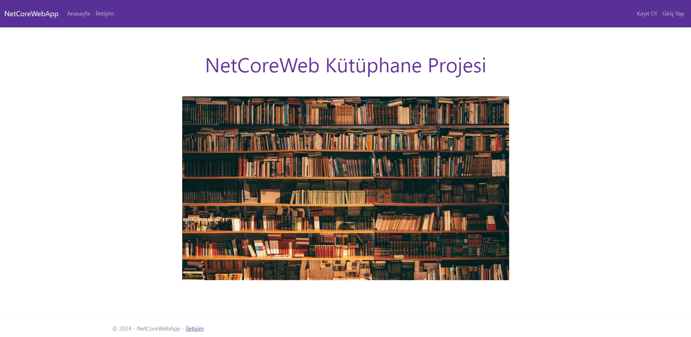
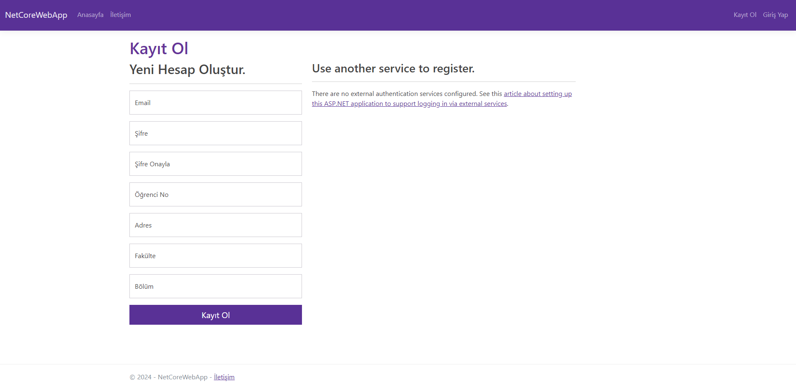
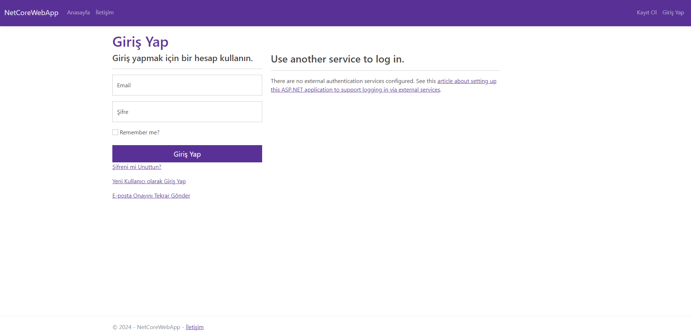
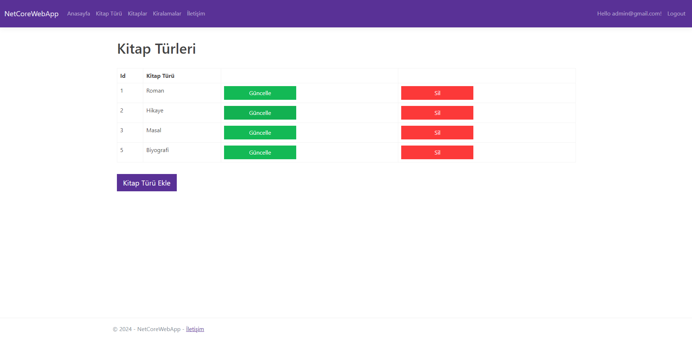
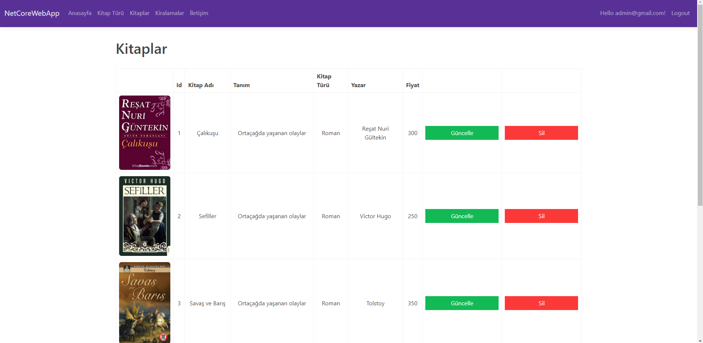
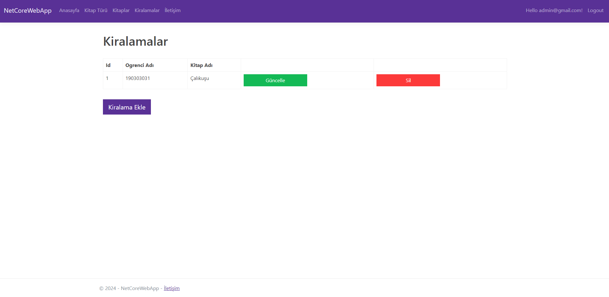
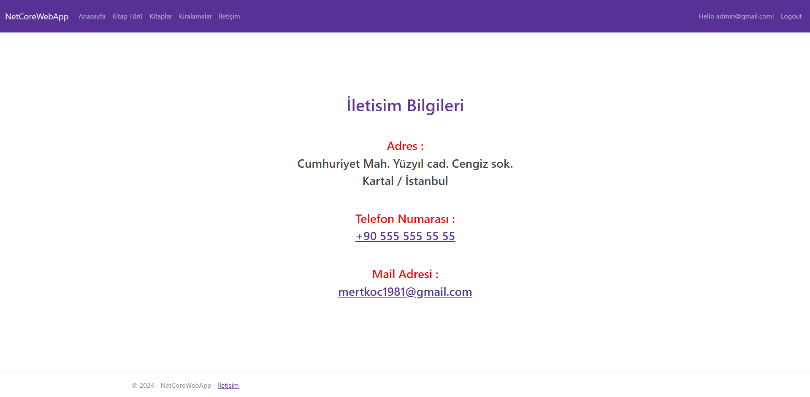
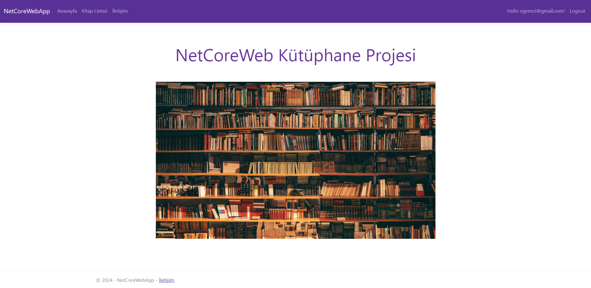
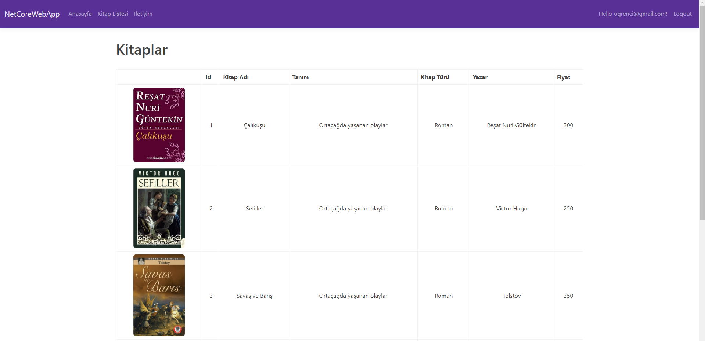

## .NET CORE KİTAP PROJESİ
Bu repository, [ASP.NET Core MVC](https://github.com/mert1981/NetCoreWebApp) altında geliştirilen bir projeyi içermektedir. Bu proje C# dilinde yazılmış ve ASP.NET Core MVC framework kullanılarak oluşturulmuştur. Frontend'de Bootstrap kullanılarak responsive ve kullanıcı dostu arayüzler tasarlanmış, backend tarafında ise güçlü ve ölçeklenebilir .NET Core mimarisi kullanılmıştır.

#### Proje Hakkında 
Bu proje, Adminin kitap, kitap türü ve kitap kiralama özelliklerini barındıran, Öğrencinin ise kitapları görüntüleyebildiği,  MVC (Model-View-Controller) mimarisi temellerini kullanarak geliştirilmiş küçük bir web uygulamasıdır.

##### Özellikler 
- Kullanıcı ekleme ve kullanıcı girişi yapma
- Admin tarafından kitap türü, kitap ve kiralama ekleme
- Öğrenci tarafından kitap listesi görüntüleme

##### Teknolojiler
- C# ASP.NET Core MVC
- Bootstrap (Frontend tasarımı)
- JavaScript (Temel interaktivite için)
- SQL Server (Veritabanı yönetimi)

###### Ekran Görüntüleri

